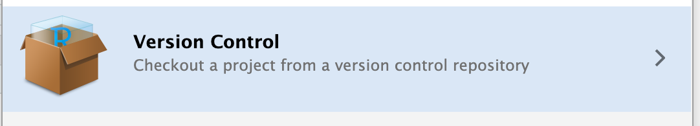
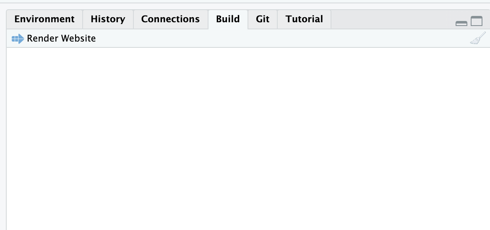
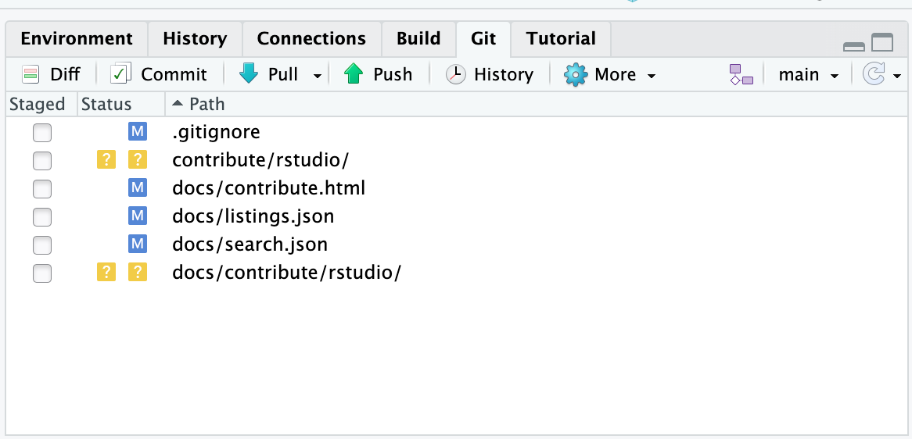

# Contributing using RStudio

(tested on **RStudio 2024.04.2** Build 764 for OSX)

Note: You need to have git installed and you need to generate a personal authentication token in your github account to be able to push your changes to the remote repo.

This has an advantage that you can edit .qmd files in visual mode and paste screenshots without having to explicitly save and link images.

1.  Go to File -\> New Project
2.  Select "Version control"



3.  Paste the git repo http path:

    ```text
    https://github.com/visualneuroscience/visualneuroscience.github.io.git
    ```

4.  Edit the local version as you wish

5.  To preview your changes locally, go to "Build" tab and press "Render Website". This opens the site in your browser.

    

6.  If you are happy switch to the "Git" tab, select either all or some files, stage and commit. After this, press "Push" to send the new content to github repo

    

7.  Every time you start editing the R project, first press "Pull" to make sure your local version contains all the most recent changes, which may have been made by others.

## Note on Windows

The difficulty on windows PC in the office has been the extreme slowness of the Git Gui window. The solution is to use the terminal (not the R console!) to commit changes and push:

``` bash
git add *  

git commit -m "yourmessage"  

git push
```

# Contributing using Visual Studio Code

You need to have [Docker](https://docs.docker.com/get-started/get-docker/) or [Podman](https://podman.io/docs/installation) installed and the [Dev Containers extension](https://marketplace.visualstudio.com/items?itemName=ms-vscode-remote.remote-containers) in VS Code. See the [dev container documentation](https://code.visualstudio.com/docs/devcontainers/containers) for more details.

R, Quarto, and all required extensions are pre-installed inside the container, so you do not need to set up anything else.

1.  Open the repository folder in VS Code.
2.  When prompted, click "Reopen in Container" (or run the command `Dev Containers: Reopen in Container`).
3.  Wait for the container to build and start. This may take a few minutes on the first run.
4.  Edit the local version as you wish.
5.  To preview your changes locally, run `quarto preview` in the terminal. This opens the site in your browser.

## Linting tools

The container includes two linters you can run from the terminal.

Check for typos:

``` bash
typos
```

Fix typos automatically:

``` bash
typos -w
```

Check Markdown formatting:

``` bash
markdownlint-cli2 "**/*.qmd" "**/*.md"
```

Fix Markdown formatting automatically:

``` bash
markdownlint-cli2 --fix "**/*.qmd" "**/*.md"
```

# General Information

## Recent Changes Section

At the starting page of the website, there is a ["Recent Changes"](../index.qmd) section at the bottom. For making this section useful, it is important to add the `date` option in the meta-data of a page (format: MM-DD-YYYY)! Additionally, when you make *meaningful and important* changes to an existing page, you also need to change the data in the meta-data of the respective page! Otherwise, the change will not be shown at the "Recent Changes" section!

## Adding new content

After getting access, you´ll see the directory structure of the website.

At the top of the hierarchy, you see the directories representing the "major topics" of the website (Labmeeting, People, Archive,...). If you want to add a page that is related to an existing topic, make sure to add it in the respective directory. If you´ll add something "new and unrelated to the rest", you can add a new directory (+ corresponding `.qmd` file).

## "Making changes visible"

After adding new content, you might have to take an additional step to actually make it visible on the website! If you created a new directory, you also have to add it in the `_quarto.yml` file! Here you have the option to add it to the menu bar at the top and/or on the side.

If you added a new page within an existing directory, it should be visible automatically.
