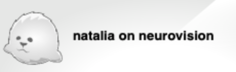

## X2go

We have activated server access via [neurodesktop](https://www.neurodesk.org) for students and lab members. This is now the default way to access the server. Please see the [dedicated page](/neurodesk/neurodesktop.qmd).

This page describes access via x2go, which was in place until 2024

<https://cloud.uni-graz.at/index.php/f/220686861>
