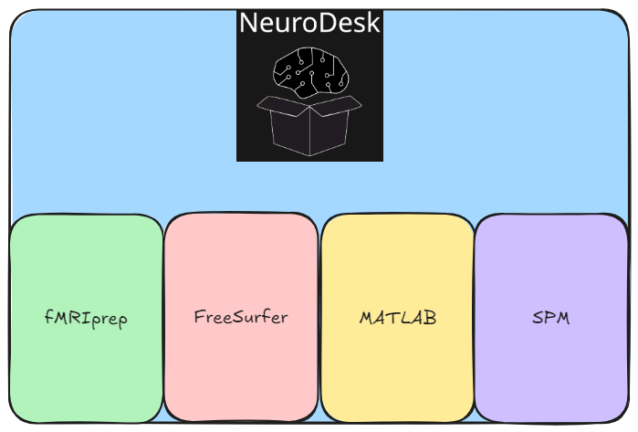
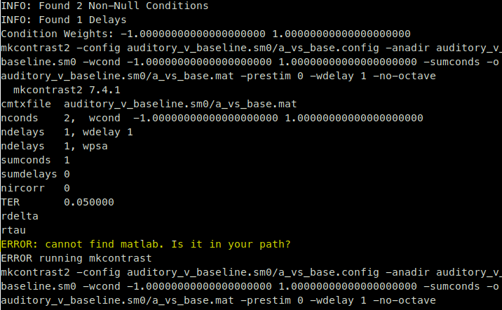
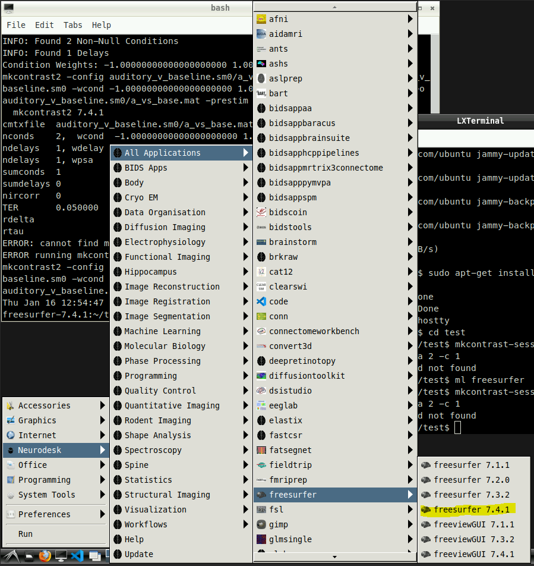

```{=html}
<style>
figcaption {
  text-align: center !important;
}
</style>
```

::: callout-note
The FSFAST glm can be run instead of using [fitlins](https://fitlins.readthedocs.io/)

Link to [FreeSurfers FSFAST tutorial](https://surfer.nmr.mgh.harvard.edu/fswiki/FsFastTutorialV5.1/FsFastFirstLevel)
:::

## Reasons to use FreeSurfers FSFAST

-   If fitlins does not have a particular option for you that you would like to use i.e. different

-   Potentially easier when working with surface space data (FSFAST was originally designed for surface space data)

## Neurodesk

### What does a container mean

-   Neurodesk has a whole host of software that is available for us to use

-   Neurodesk works in which each piece of software has its own container

-   Simply put for us this means that we use 1 piece of software that is contained inside its own environment

{fig-align="center"}

-   So for the example above if you were inside of the [FreeSurfer]{style="background-color: #ffc9c9; color: #1a1a1a;"} container the only available software to you would be FreeSurfer

-   [MATLAB]{style="background-color: #ffec99; color: #1a1a1a;"}, [fMRIprep]{style="background-color: #b2f2bb; color: #1a1a1a;"} and [SPM]{style="background-color: #d0bfff; color: #1a1a1a;"} would not be available to you

::: callout-note

## Note: MATLAB runtime environment

However, FreeSurfer uses something called a **MATLAB runtime environment**

-   MATLAB runtime environment is smaller piece of software that **is** inside the FreeSurfer container

-   FreeSurfer commands can be run without the **whole** of MATLAB directly and instead use this "MATLAB runtime environment"
:::

------------------------------------------------------------------------

## FreeSurfer commands that do rely on the MATLAB runtime environment

-   Sometimes when running FreeSurfer commands on neurodesk you might run into an error like so:

{fig-align="center"}

-   What this means is the following:

    1.  FreeSurfer by default is looking for a whole MATLAB installation

    2.  FreeSurfer does not know whether there is a MATLAB runtime environment

        > This is because the MATLAB runtime environment is installed in a folder somewhere

## Steps to run FreeSurfer commands

**1. Start a FreeSurfer container:**

{fig-align="center"}

**2. Set up your environment variables:**

-   When using FreeSurfer it's important to tell FreeSurfer where to find the subjects directory (SUBJECTS_DIR)

> (see [FreeSurfers FSFAST tutorial](https://surfer.nmr.mgh.harvard.edu/fswiki/FsFastTutorialV5.1/FsFastFirstLevel) for more information)

For example:

```bash
export SUBJECTS_DIR=$TUTORIAL_DATA/buckner_data/tutorial_subjs
```

**3. Change directory to where your data is:**

For example:

```bash
cd data
```

**4. Try and run the command first:**

For example:

`Freeview` ← this doesn't rely on MATLAB so the freeview window should open

`recon-all` ← this doesn't rely on MATLAB either so should work

`mri_vol2vol` ← this doesn't rely on MATLAB so should also work

`mkcontrast-sess` ← this does rely on MATLAB runtime environment

**5. What to do if your command doesn't work?**

If you run a command for example:

```bash
mkcontrast-sess -analysis auditory_v_baseline.sm0   -contrast a_vs_base -a 2 -c 1
```

And then see an error like so:

{#fig-error}

-   This means that FreeSurfer doesn't know where the MATLAB runtime environment is therefore run the following:

```bash
export FS_MCRROOT=/opt/MCR2019b/v97/
```

### The command above is important to tell FreeSurfer where the MATLAB runtime environment is

### 6. Re-run the command again

> If you fall into the error as above @fig-error : then run the command using `-mcr 1`

For example:

```bash
mkcontrast-sess -analysis auditory_v_baseline.sm0   -contrast a_vs_base -a 2 -c 1 -mcr 1
```
