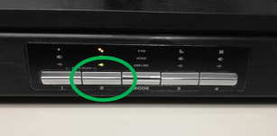
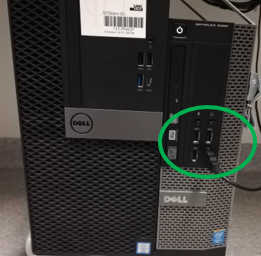
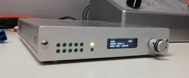

## General setup information

-   Make sure to switch to the Linux computer (the button number 2 under the monitor)
-   Login with credentials you received

-   Once logged in:
-   If you plan to use MATLAB, you’re going to need internet connection: Einstellungen -\> Netzwerk -\> Kabel -\> Here you can choose between Internet or Eyelink (it should default to the internet)
-   Check if the trigger box is connected to the computer (and at the correct USB Port is used – bottom right):

-   Start MATLAB / Octave and test the trigger box with the script response_box_check.m

-   8 lights on the left are blinking whenever the 8 buttons on the response boxes are being pressed
-   On the right, the top light is constantly turned on if it is connected to the computer. On the bottom, the light is blinking whenever the scanner trigger is being sent.

## Experimental Protocol

-   Participants can fill out the forms in the lobby. You can also instruct them there.
-   Paperwork: ...
-   Snellen chart is available behind one of the changing rooms. There, an MRI-compatible googles are available as well, with lenses of different diopters in the suitcase. The goggles and lenses should be disinfected before and after each use!
