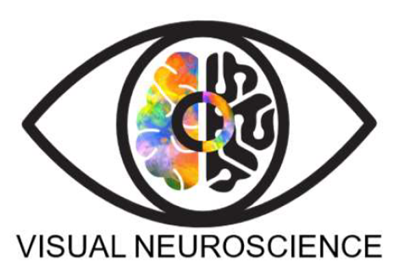

```{=html}
<section class="hero">
  <div>
    <div class="hero-title" role="heading" aria-level="1">Visual Neuroscience lab</div>
    <h3 class="hero-about">About</h3>
    <p class="hero-lead">We investigate how subjective experience arises from sensory input and how this is represented in the brain.</p>
    <p class="hero-meta">PI: Natalia Zaretskaya</p>
    <div class="hero-links">
      <a class="btn btn-primary" href="https://github.com/visualneuroscience">GitHub</a>
      <a class="btn btn-outline-secondary" href="https://neurovision.uni-graz.at">Uni Graz</a>
      <a class="btn btn-outline-secondary" href="https://calendar.online/cadcb4379c842ce87f53">Lab calendar</a>
    </div>
  </div>
  <figure class="hero-figure">
    
  </figure>
</section>

<h2 class="home-section-title"><span class="home-section-number">A</span>Start here</h2>
<div class="index-grid">
  <a class="index-row" href="people/onboarding/joining-the-lab.qmd">
    <span class="index-number">01</span><span class="index-title">New to the lab?</span><span class="index-arrow">&rarr;</span>
    <span class="index-text">Your first-week checklist: keys, safety, Slack, lab meeting, time tracking.</span>
  </a>
  <a class="index-row" href="resources/neurodesktop/neurodesktop.qmd">
    <span class="index-number">02</span><span class="index-title">Server access</span><span class="index-arrow">&rarr;</span>
    <span class="index-text">Get an account and work on Neurodesk.</span>
  </a>
  <a class="index-row" href="mri/mri-studies-general/mri-studies-general.qmd">
    <span class="index-number">03</span><span class="index-title">Running a study</span><span class="index-arrow">&rarr;</span>
    <span class="index-text">Planning, ethics, preregistration, recruiting and running sessions.</span>
  </a>
</div>

<h2 class="home-section-title"><span class="home-section-number">B</span>Browse by topic</h2>
<div class="index-grid">
  <a class="index-row" href="people/index.qmd">
    <span class="index-number">01</span><span class="index-title">People</span><span class="index-arrow">&rarr;</span>
    <span class="index-text">Joining and leaving the lab, lab meeting, coffee, writing, talks, funding.</span>
  </a>
  <a class="index-row" href="mri/index.qmd">
    <span class="index-number">02</span><span class="index-title">MRI</span><span class="index-arrow">&rarr;</span>
    <span class="index-text">Running MRI studies, the DICOM to GLM pipeline and tools.</span>
  </a>
  <a class="index-row" href="behavioral/index.qmd">
    <span class="index-number">03</span><span class="index-title">Behavioral</span><span class="index-arrow">&rarr;</span>
    <span class="index-text">Vision tests, BIDS for behavioral data.</span>
  </a>
  <a class="index-row" href="resources/index.qmd">
    <span class="index-number">04</span><span class="index-title">Resources</span><span class="index-arrow">&rarr;</span>
    <span class="index-text">Neurodesktop, power analysis, participant compensation, gamma correction, chin rests, this website.</span>
  </a>
  <a class="index-row" href="internship/index.qmd">
    <span class="index-number">05</span><span class="index-title">Internships</span><span class="index-arrow">&rarr;</span>
    <span class="index-text">Checklist, compulsory internship (Pflichtpraktikum), past projects.</span>
  </a>
  <a class="index-row" href="archive/index.qmd">
    <span class="index-number">06</span><span class="index-title">Archive</span><span class="index-arrow">&rarr;</span>
    <span class="index-text">Older guides and setups, kept for reference.</span>
  </a>
</div>

<h2 class="home-section-title"><span class="home-section-number">C</span>Recent Changes</h2>
```

::: {#recent}
:::
