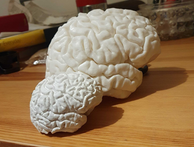

There are many guidelines and tutorials on how to 3D print a brain. The currently recommended procedure is to use this docker image:

<https://github.com/nimaid/mri2stl>

The advantage is that the brain is printed with the cerebellum, and the number of things you manually need to do is minimal.

