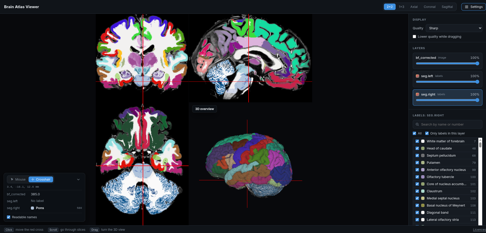

Explore the left and right hemisphere segmentation on the scan, slice by slice and in 3D, and see which structure is at any point.

[Open the viewer ↗](viewer/dist/viewer.html){.btn .btn-primary target="_blank"}

## How to use it

- **Show the labels:** they start hidden. Open **Settings** and move the opacity slider of `seg.left` or `seg.right`.
- **Navigate:** click to move the red cross, scroll to go through slices, and drag to turn the 3D view.
- **Change the layout:** the buttons at the top switch between 2×2, 1×3 and a single axial, coronal or sagittal slice.
- **Identify structures:** the box in the lower left shows the coordinates and the label under the mouse, or at the red cross in **Crosshair** mode.
- **Find or hide labels:** click a label layer in **Settings** to list its labels, then search them by name or number and untick labels to hide them.

The viewer opens in a new tab. Use a desktop browser.

To use it offline, right-click the button, choose **Save link as…**, and open the saved file.