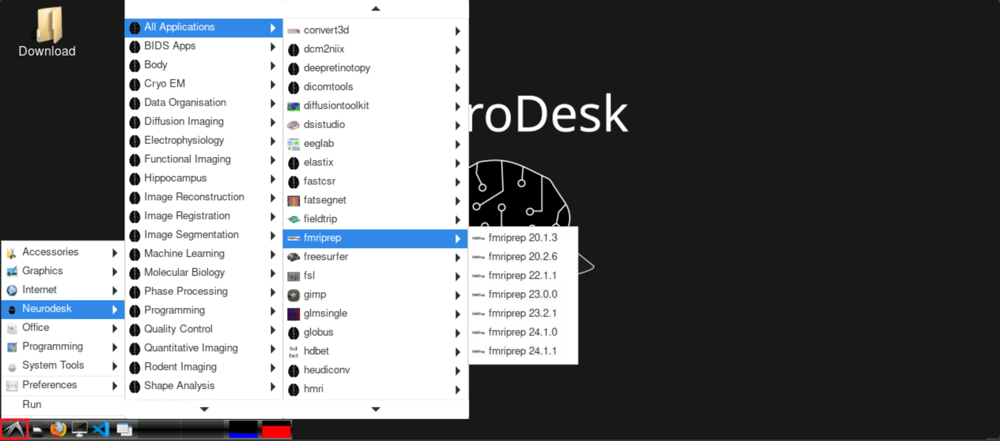
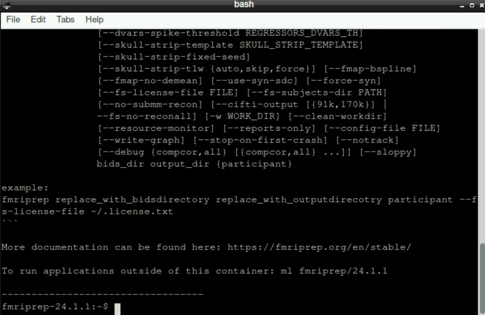
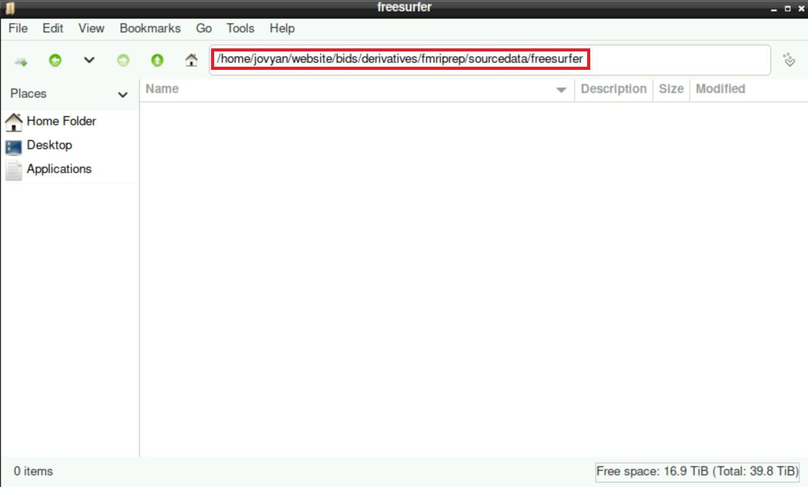
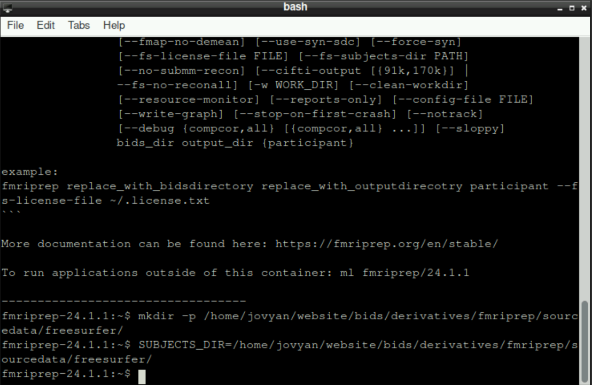

fMRIprep is a helpful and standardized preprocessing pipeline for BIDS-valid datasets. By combining various neuroimaging software packages (FSL, ANTs, FreeSurfer,...) it allows us to run various preprocessing steps automatically:

1.  Anatomical (T1w) preprocessing
    -   Bias field correction
    -   Skull stripping
    -   Surface reconstruction
    -   Spatial normalization
    -   Tissue segmentation
2.  Functional (BOLD) preprocessing
    -   Slice time correction
    -   Motion correction
    -   Susceptibility distortion correction
    -   Co-registration
    -   Spatial normalization
    -   Brain masking
    -   Confound estimation
    -   Resampling

# Before running fMRIprep {#sec-NecessitiesFmriprep}

Before you start fMRIprep, you have to make sure, that you:

1.  [have nifti files in BIDS format](01-dicom-to-bids.qmd)

2.  [defaced your anatomical scans](04-defacing.qmd)

3.  [Optional: removed the noise scans from your functional data](05-remove-noise-scan.qmd)

4.  [Check the IntendedFor field of the fmaps JSON file](02-check-intendedfor-field.qmd)

# Running fMRIprep step by step

## Starting fMRIprep {#sec-fmriprepStart}

To start fMRIprep, click on the bird symbol at the bottom left on neurodesk and navigate to `Neurodesk > All Applications`, and find `fmriprep`. Select the version that you want to use 

After selecting your version, a new terminal opens and loads the chosen fMRIprep version. This can take a few moments, be patient! When everything is ready, the bottom line should state `fmriprep-"Version"` (with "Version" being whatever version you selected, for example `fmriprep-24.1.1`) 

## Setting up necessary directories and defining "SUBJECTS_DIR" {#sec-fmriprepSetup}

First, you need to create some new directories that are necessary for fMRIprep to run properly. For this, enter the following command (adapt the path(s)!)

``` bash
mkdir -p /home/jovyan/website/bids/derivatives/fmriprep/sourcedata/freesurfer/
```

By confirming your command with Enter, you´ll find the new directory structure within you derivatives directory

Then, we need to specify where fMRIprep should store the resulting files (again, adapt the path(s) if necessary):

``` {.bash .copy-code}
SUBJECTS_DIR=/home/jovyan/website/bids/derivatives/fmriprep/sourcedata/freesurfer/
```



**Hint:** you can copy/paste both commands from above and execute them by pressing enter simultaneously, it doesn´t matter

## fmriprep command {#sec-fmriprepCommand}

::: callout-warning
Before continuing, make sure that you have **your own** FreeSurfer License file!!!! You can request this file in a few minutes on this website: <https://surfer.nmr.mgh.harvard.edu/registration.html>

You´ll get a file called `license.txt` containing your information. Store this file somewhere on the server and correctly indicate it with the flag `--fs-licence-file /path/to/your/own/license.txt`

**Do not use the `license.txt` file from someone else, EVERYONE should get their own!**
:::

With the setup done, you can now run the command (for more information about the commands/flags, please refer to the [fMRIprep documentation](https://fmriprep.org/en/stable/usage.html):

``` {.bash .copy-code}
fmriprep /home/jovyan/website/bids /home/jovyan/website/bids/derivatives/fmriprep participant --bold2t1w-init header --force-bbr -w /home/jovyan/website/fmriprep_tmp --output-spaces T1w fsaverage fsnative --participant-label sub-999 --nprocs 8 --mem 10000 --skip_bids_validation --stop-on-first-crash -v --fs-license-file /home/jovyan/website/freesurferlicense/license.txt
```

**Important:** adapt the flag `--participant-label sub-999` accordingly, so that you state the subject you want to preprocess

**Hint:** same as before, you could run this command simultaneously with the two commands above for the setup. The only important thing is the order: first the command for making the directories, then defining `SUBJECTS_DIR` and finally the fMRIprep command.

## Waiting

After fMRIprep started, it´s probably time to get a coffee and do something else. This process will take quite some time (hours), you don´t have to stare at the output the whole time. You can also close the Tab where you opened neurodesk! Even if you close it, the program continues its work as your server keeps running!

If you know that a potential server reboot is scheduled, it may be useful to write a quick message in the `Server` channel on slack, as the reboot would cancel your program and you have to start it (and wait) again.

# Running fMRIprep with a script

Especially when processing multiple subjects, it can be useful to run fMRIprep using a `bash` script, as you can loop through the subjects without having to start the process manually every time.

You can see an example script to achieve this below (which is also available at `/shared/website/run_fmriprep.sh`). To adapt this to your needs, you have to:

1.  Adapt the structure to the subjects (and their "naming") you want to process: change the instances of `sub-1400` and the entries in the variable `participant_labels` to match your data

    $\to$ in this case, the data of every subject is (according to BIDS) in a subdirectory. The name of these directories always start with `sub-1400` with the last two digits differing between subjects. In every iteration of the for-loop, the corresponding entry of the list in `participant_labels` (which always is a 2-digit number) is the value for `label`. This value is substituted for `$label` everywhere within the loop, e.g. resulting in `sub-140001` in the first iteration, `sub-140002` in the second iteration, and so on.

2.  Adapt the line `ml fmriprep/23.0.0`: you can select any version of fMRIprep that is available on neurodesk (see @sec-fmriprepStart for how to check which version are available). If you want to use a different version, you have to use Singularity (you need a singularity image and basically replace the word `fmriprep` in the command with `singularity run --cleanenv /Path/to/fmriprep-<<Version>>.simg`; [see the documentation](https://fmriprep.org/en/1.1.4/installation.html)

3.  Adapt the path to your data (and the building of the corresponding necessary directories)

``` {.bash .copy-code}
participant_labels=(01 02 03 04 05)

ml fmriprep/23.0.0

mkdir -p /home/jovyan/thesis_data/bids/derivatives/fmriprep/sourcedata/freesurfer/
SUBJECTS_DIR=/home/jovyan/thesis_data/bids/derivatives/fmriprep/sourcedata/freesurfer/

export SINGULARITYENV_SUBJECTS_DIR=$SUBJECTS_DIR
export APPTAINERENV_SUBJECTS_DIR=$SUBJECTS_DIR

for label in "${participant_labels[@]}"; do
    fmriprep /home/jovyan/thesis_data/bids /home/jovyan/thesis_data/bids/derivatives/fmriprep participant --bold2t1w-init header -w /home/jovyan/thesis_data/fmriprep_tmp/sub-1400$label --output-spaces T1w fsaverage fsnative --participant-label sub-1400$label --nprocs 8 --mem 20000 --skip_bids_validation --stop-on-first-crash -v --fs-license-file /home/jovyan/completion/freesurferlicense/license.txt
done
```

Keep in mind, that with running fMRIprep for multiple subjects subsequently, the runtime scales with the number of subjects. Be aware of potential server restarts and other running processes!

# Troubleshooting

$\to$ If there are any problems, please refer to the dedicated [troubleshooting page](troubleshooting.qmd#sec-TroublesFmriprep)

# The next steps

Congratulations, you successfully preprocessed your data and you are one step closer to analyzing your data!

:::callout-warning

## IMPORTANT

**ALWAYS** check the output of fMRIPrep to ensure that everything worked properly!!!

The `.html` report that fMRIPrep automatically provides a good overview to detect potential problems (e.g. [bad coregistration](./troubleshooting.qmd#sec-coreg))
:::

To continue in your journey to your Analysis, please return to the [Overview-Page](00-overview.qmd) to check what to do next.

Alternatively, here is a list of potential next steps to continue with

1.  [Retinotopic Mapping](07-retinotopic-mapping.qmd)

2.  [first-level GLM](08-first-level-glm.qmd)

3.  [ROI analysis](09-roi-analysis.qmd)
