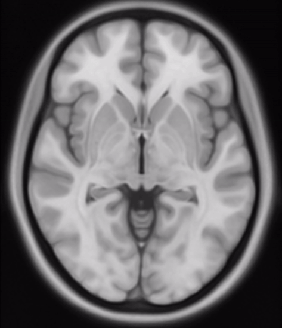

This is a summary of useful information about MNI spaces, collected by Carmen. This page should be extended at some point to incorporate lab-specific information.

Short: [About the MNI space(s) – Lead-DBS](https://www.lead-dbs.org/about-the-mni-spaces/)

Detailed and up-to-date: [About the mNI space(s) - BIDS Team](https://bids-specification.readthedocs.io/en/latest/appendices/coordinate-systems.html)

{width="206"}
