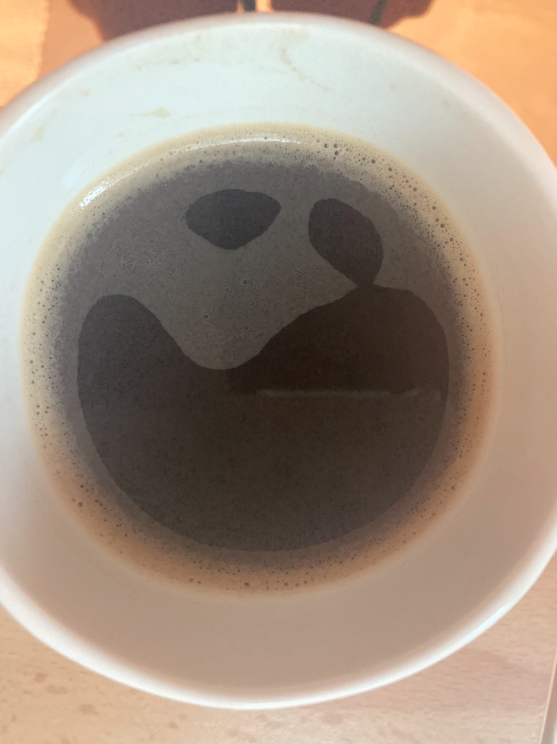
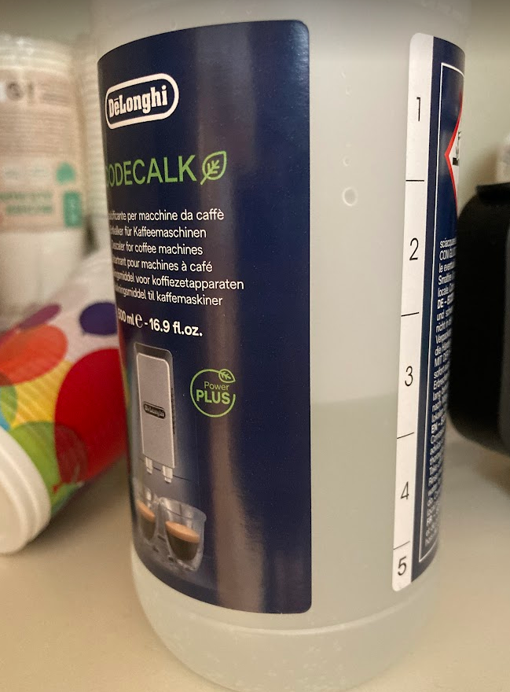
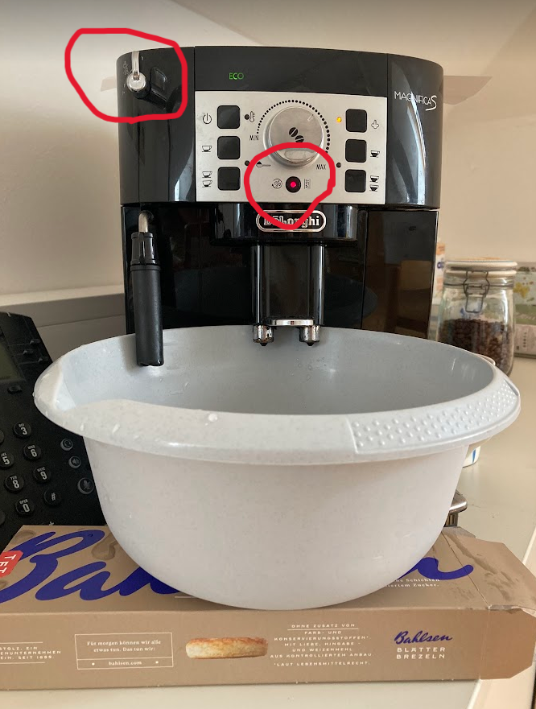
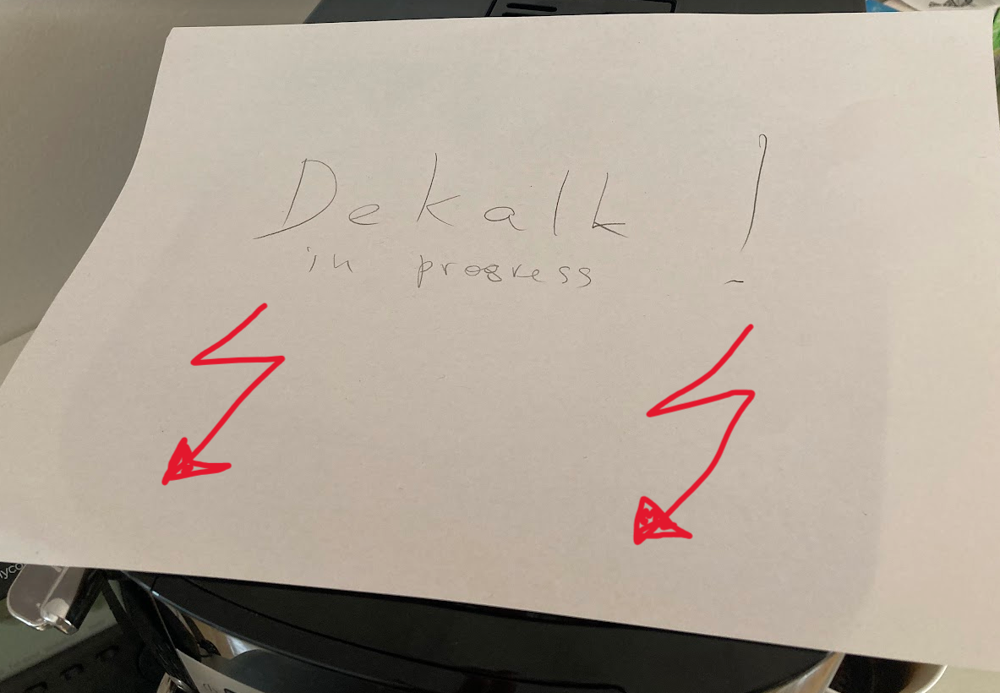

## History

Coffee machine was acquired by the first generation of doctoral students #ana and #marilena . They kindly passed it on to future generations when leaving the lab.

{width="384"}

# CoffeeCare

Respecting their legacy, we need to take good care of the coffee machine.

## General

There is only one thing to do: Empty the water container at the end of the day.

## Decalcify

When the red light is blinking, it is time to decalcify. Do it right away, do not wait until the coffee machine is completely blocked by calcium to create a coffee flood in the office. Here are the steps:

1\. Turn on the coffee machine and wait until it is ready (if it was on before, turn it off and on, to get rid of coffee rests in the pipes)

2\. Empty the water tank, and add fill it with decalk fluid (located in the cupboard) until section "A" (alternatively, you can add the amount equivalent to one section of the botttle). Add normal water until section "B". Insert the water tank back into the coffee machine.

3\. Insert the grey plastic bowl (located in the same cupboard) at a place where you usually put your cup. You may need something additional to support it, like a cookie box.

4.  Press the blinking red light for 5 seconds (until it stops blinking)
5.  Turn the small handle at the top left form 0 to I and wait for 10-20 minutes
6.  Once the water indicator is blinking red, return the handle from I to 0
7.  Empty the grey bowl and place it back
8.  Fill the water container with water until section "MAX"
9.  Turn the small handle to I
10. Once the water indicator is blinking red, return the handle from I to 0
11. Repeat from step 8 onwards
12. After the second loop the red light that was originally blinking should extinguish
13. Enjoy your coffee :-)

P.S. Don't forget to put a note that there is a decalcification in progress, to avoid any interference from your coffee-hungry colleagues

