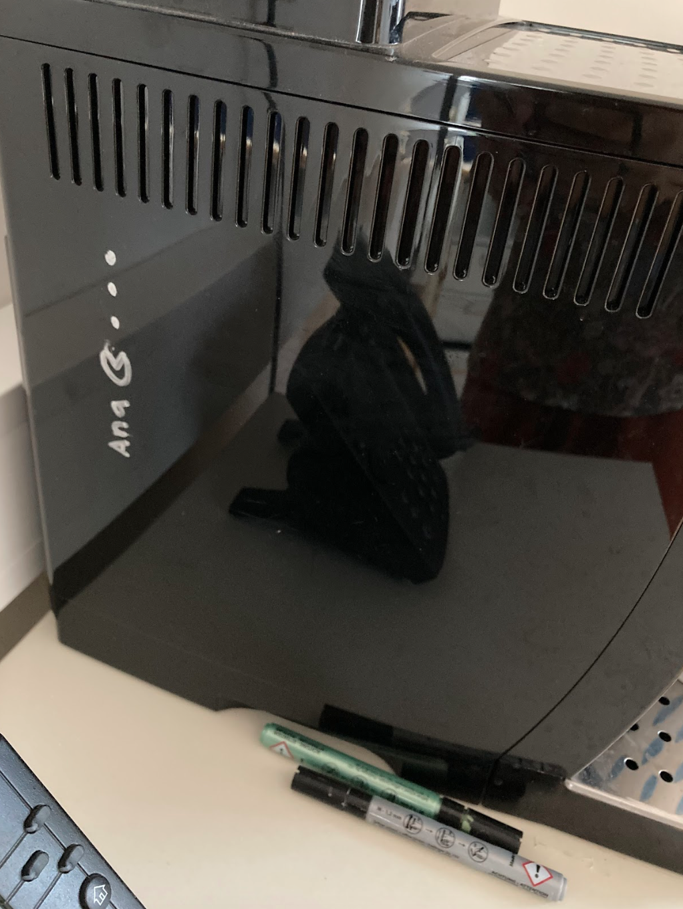

# Things to do if you are leaving the lab

Leaving can be sad. In addition, there is a ton of boring admin work to be done.

## Papers

-   [ ] Make sure all published papers are entered into the Forschungsportal

-   [ ] Make sure all revised manuscript versions and published papers are updated on biorXiv, psyarXiv, medarXiv preprint servers

## Admin

-   [ ] Return your key to Chrissy once you don't need a desk
-   [ ] [Extend your UGOnline account if needed](#sec-extend)

## Data

-   [ ] Make sure that all subject's private data that is irrelevant for research (e.g. bank account information for reimbursement) is deleted from the server, from local institute's computers and from your private computer if relevant
-   [ ] Make sure that all incidental findings have been clarified, and once this is the case, delete subjects' contact information if you kept it
-   [ ] At the top level of your directory on /storage, create a text/markdown file named "projects" containing server paths (/storage/, J:, or external storage in the case of MW) as follows in the example below
-   [ ] It would be nice if you could put a contact email for after your uni-graz email address expires (optional, of course) at the top of this file

1.  project nickname

2.  Final version (from the MRI/behavioral lab) of the stimulus script

3.  Raw data (whichever applies)

    a.  behavioral
    b.  eyetracking
    c.  physiology
    d.  (f)MRI
    e.  pdf of the MRI protocol

4.  Subject-level analysis scripts (including preprocessing)

5.  Subject-level results

6.  Group analysis scripts

7.  Group results

8.  Latest version of the submitted manuscript with rebuttal, if applicable. For master students: your UGOnline submitted thesis, preferably in word format

9.  Posters and submitted conference abstracts related to the study

10. Location of the consent forms (either electronic or paper)

    ### Example:

`/storage/natalia/projects.md`

For neurodesk users, the projects file can be in your home directory:

```         
/home/jovyan/
```

#### Fast and functionally specific cortical thickness changes induced by visual stimulation

1.  project nickname: hexcite
2.  stimulus script: #todo
3.  Raw data
    -   bahavior: `/storage/nv_shared/projects/excitex/matfiles/`
    -   MRI: `/storage/nv_shared/projects/excitex/bids/`
    -   PDF of the MRI protocol: `/storage/nv_shared/projects/excitex/111_NZ03_excite_autoalign.pdf`
4.  First level analysis scripts (including preprocessing): `/storage/natalia/projects/hexcite/analyze_hexcite_struc_R1.sh`, `/storage/natalia/projects/hexcite/analyze_hexcite_fmri.sh`
5.  Subject-level results `/storage/natalia/projects/hexcite/bids/derivatives/`
6.  Group analysis scripts `/storage/natalia/projects/hexcite/bids/code/analyze_hexcite_final.m`
7.  Group results: `/storage/natalia/projects/hexcite/group_lowres/`
8.  Latest version of the submitted manuscript with rebuttal: `/storage/natalia/projects/hexcite/manuscript/hexcite_CerCor_R1`
9.  Posters and submitted conference abstracts related to the study `/storage/natalia/projects/hexcite/presentations`
10. Paper - Corner office, rightmost drawer

## Optional: Extend UGO Account {#sec-extend}

It is possible to extend your UniGrazOnline account beyond the end of your contract. This might be necessary if there´s still work to do beyond your employment (e.g. planned publications). As you have to file a request, you should do this early enough to ensure it can be processed in time.

To extend your access:

-   [ ] 1. Go to the uni sharepoint (and log in with your account): <https://sharepoint.uni-graz.at/sites/602>

-   [ ] 2. Go to "Information for Staff Members" (or "MitarbeiterInnen-Informationen" in german) in the menu bar at the top (or directly click [this for the english](https://sharepoint.uni-graz.at/sites/602/MitarbeiterInnenInformationen/Information%20for%20Staff%20Members.aspx) or [this link for the german](https://sharepoint.uni-graz.at/sites/602/MitarbeiterInnenInformationen/MitarbeiterInnen-Informationen.aspx) version)

-   [ ] 3. Select the topic ["Leaving the department"](https://sharepoint.uni-graz.at/sites/602/MitarbeiterInnenInformationen/Account%20extension.aspx) (German: ["Ende des Dienstverhältnisses"](https://sharepoint.uni-graz.at/sites/602/MitarbeiterInnenInformationen/Accountverl%C3%A4ngerung.aspx))

-   [ ] 4. At the last bulletpoint of the page, click on the [link embedded with the word "here"](https://sharepoint.uni-graz.at/sites/602/zentralbereich/service/Lists/Accountverlaengerungen/AllItems.aspx) (German: ["Accountverlängerung"](https://sharepoint.uni-graz.at/sites/602/zentralbereich/service/_layouts/15/start.aspx#/Lists/Accountverlaengerungen/AllItems.aspx))

-   [ ] 5. On the final page (only showing in german language!), click "Neues Element", located directly under the title "Accountverlängerung"

-   [ ] 6. Select your entry in the drop-down menu of the first field (= "Mitarbeiter\*in")

-   [ ] 7. Provide the reason why you want to extend your contract in the field below (= "Begründung")

-   [ ] 8. Select a date until when you want to extend your UGO access (= "Enddatum")

-   [ ] 9. Indicate the reason why you would loose access to your account ("Grund"), either "end of contract" (= "Anstellungsende") or "retirement" (= "Pension")

-   [ ] 10. Submit the request by saving it (= "Speichern")

Subsequently, you should see your request in the list. After evaluation by the department head(s), the request will be processed by the deans office before the extension is implemented by the IT-Staff.

# Reward

Once you managed all of the above, you are a hero! Feel free to take a marker and leave a sign on the coffee machine.


