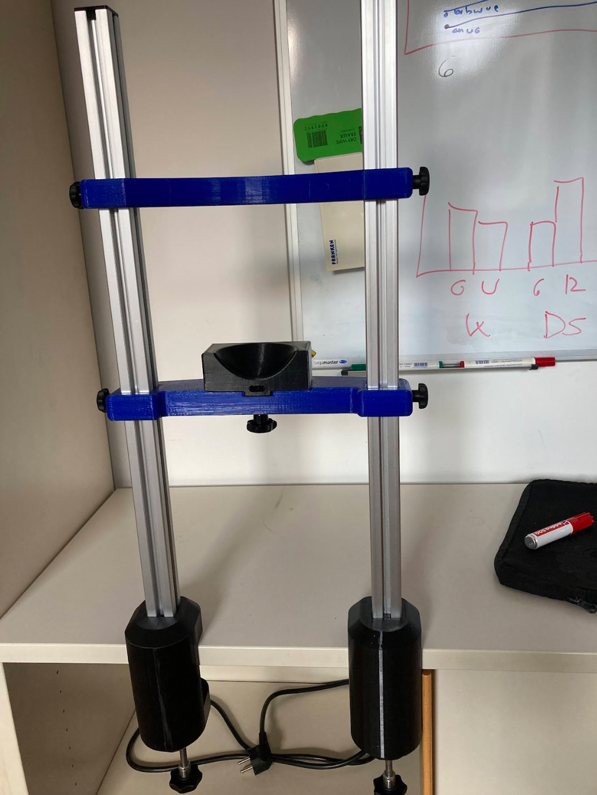

If you need a solid chinrest for your behavioral, EEG or brain stimulation experiment, we can create one ourselves using 3D printing, some standard parts and this tutorial

<https://www.thingiverse.com/thing:2968729#google_vignette>

with some adaptations/improvements. If you need a chinrest, talk to Lukas. Note that it may take a few weeks since some parts need to be orders and or/printed.

The result will look something like this:

{width="285"}
