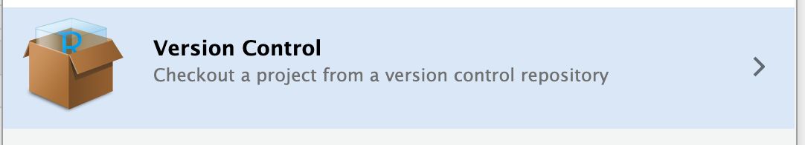
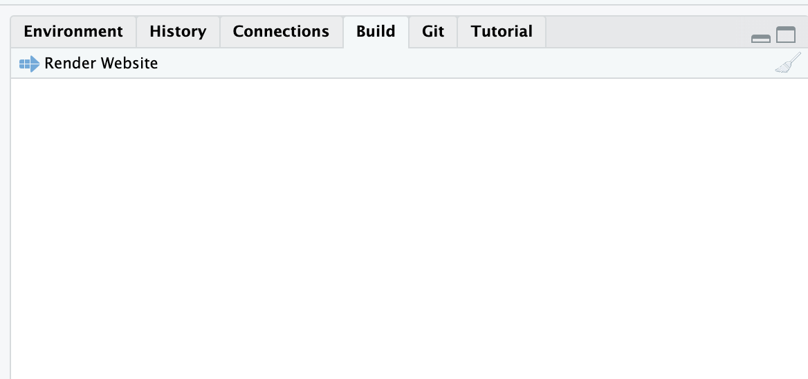
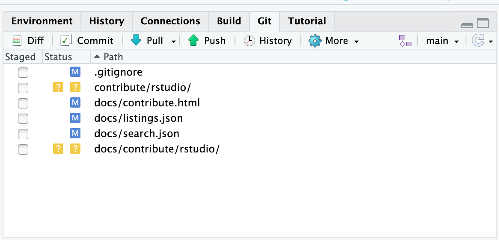

# Contributing using RStudio

(tested on **RStudio 2024.04.2** Build 764 for OSX)

Note: You need to have git installed and you need to generate a personal authentication token in your github account to be able to push your changes to the remote repo.

This has an advantage that you can edit .qmd files in visual mode and paste screenshots without having to explicitly save and link images.

1.  Go to File -\> New Project
2.  Select "Version control"



3.  Paste the git repo http path:

    ```text
    https://github.com/visualneuroscience/visualneuroscience.github.io.git
    ```

4.  Edit the local version as you wish

5.  To preview your changes locally, go to "Build" tab and press "Render Website". This opens the site in your browser.

    

6.  If you are happy switch to the "Git" tab, select either all or some files, stage and commit. After this, press "Push" to send the new content to github repo

    

7.  Every time you start editing the R project, first press "Pull" to make sure your local version contains all the most recent changes, which may have been made by others.

## Note on Windows

The difficulty on windows PC in the office has been the extreme slowness of the Git Gui window. The solution is to use the terminal (not the R console!) to commit changes and push:

``` bash
git add *  

git commit -m "yourmessage"  

git push
```

# Contributing using Visual Studio Code

You need to have [Docker](https://docs.docker.com/get-started/get-docker/) or [Podman](https://podman.io/docs/installation) installed and the [Dev Containers extension](https://marketplace.visualstudio.com/items?itemName=ms-vscode-remote.remote-containers) in VS Code. See the [dev container documentation](https://code.visualstudio.com/docs/devcontainers/containers) for more details.

R, Quarto, and all required extensions are pre-installed inside the container, so you do not need to set up anything else.

1.  Open the repository folder in VS Code.
2.  When prompted, click "Reopen in Container" (or run the command `Dev Containers: Reopen in Container`).
3.  Wait for the container to build and start. This may take a few minutes on the first run.
4.  Edit the local version as you wish.
5.  To preview your changes locally, run `quarto preview` in the terminal. This opens the site in your browser.

## Linting tools

The container includes two linters you can run from the terminal.

Check for typos:

``` bash
typos
```

Fix typos automatically:

``` bash
typos -w
```

Check Markdown formatting:

``` bash
markdownlint-cli2 "**/*.qmd" "**/*.md"
```

Fix Markdown formatting automatically:

``` bash
markdownlint-cli2 --fix "**/*.qmd" "**/*.md"
```

# General Information

## Recent Changes section

The home page has a ["Recent Changes"](../../index.qmd) list. It is sorted by the `date` field in each page's metadata, so always set a `date` in the format `YYYY-MM-DD` (for example `date: 2026-09-23`). When you make *meaningful and important* changes to an existing page, update its `date` too. Otherwise, the change will not show up in the list.

## Adding new content

The website is organized into sections. Each section is a directory with an `index.qmd` landing page:

| Directory | Section | Content |
| --- | --- | --- |
| `people/` | People | Joining and leaving the lab, lab meeting, coffee, writing and presenting, funding |
| `mri/` | MRI | Running MRI studies, the DICOM to GLM pipeline (`mri/dicom-to-glm/`), tools |
| `behavioral/` | Behavioral | Vision tests, BIDS for behavioral data |
| `resources/` | Resources | Neurodesktop, power analysis, participant compensation, gamma correction, chin rests, this guide |
| `internship/` | Internships | Internship checklist, Pflichtpraktikum, project list |
| `archive/` | Archive | Outdated pages that are kept for reference |

To add a page, create a new directory inside the matching section: `<section>/<topic>/`. Put your `.qmd` file in it, and put its images in `<section>/<topic>/images/`. Start the file with metadata like this:

``` yaml
---
title: "<Page title>"
description: "<One sentence that says what this page is about>"
author: <your initials>
categories: [<Category>]
date: <YYYY-MM-DD>
image: images/<preview>.png   # optional, shown on the section's cards
---
```

### Naming files

Use short, descriptive, lowercase names with hyphens for pages, folders and images, for example `mri/dicom-to-glm/04-defacing.qmd` or `images/trigger-box-settings.jpg`.

## Making changes visible

A new page appears on the website only after you add it in two places:

1. **The sidebar:** in `_quarto.yml`, add the path of your page under the sidebar of its section (for example below `id: mri`), in the subsection where it belongs.
2. **The section cards:** in the section's `index.qmd` (for example `mri/index.qmd`), add the path of your page to the `contents` of the matching listing.
